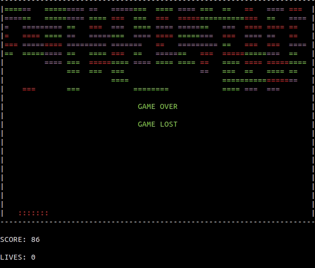

# console-arkanoid

An implementation of Arkanoid game using Haskell Monad transformer RWST in combination with the Free monad.
Here, I implement a simple Arkanoid game which is interpreted in two ways:

- In the IO monad in order to play the game, getting the input commands from stdin and printing
the game snapshots on the console.  

- In a pure custom monad for testing purposes.

<br />

```haskell
-- | The ArkanoidGame monad (abstract).
-- Reader for reading the 'Env'.
-- Writer for writing the multiple 'Event's on a log.
-- State for keeping the state of the game 'ArkanoidState'.
-- Free for defining actions which need to be interpreted depending on the context 
-- (IO for printing on the terminal or pure for testing)   
newtype ArkanoidGame a = ArkanoidGame { runPG :: RWST Env (Seq Event) ArkanoidState (Free ArkanoidF) a  }
  deriving 
    ( Functor
    , Applicative
    , Monad
    , MonadFree ArkanoidF
    )


-- | A monad for interpreting a game in a pure fashion. 
-- Writer for keeping track of 'ArkanoidState' snapshots (a pure printing)
-- Except because the interpretation of a game can fail due to
-- a sequence of commands invalid: an execution of a game with no result.    
type PureInterM a = WriterT (Seq ArkanoidState) (Except InvalidGame) a 


game :: ArkanoidGame ()
game = 
  let go = do 
        unlessM checkGameTerminated $ do
          whenM checkGamePaused $ do waitForUnpauseCommand >>= handleCommand
          checkWallBounce
          checkPaddleBounce
          checkBrickBounce
          cmd <- getCommand 
          handleCommand cmd
          when (cmd == Tick) printGameSnapshot
          go
        printGameSnapshot
  in logEvent GameStarted >> go

```

## Thread processes
<br />

The main thread forks 4 threads in order to run the various parts of the program.

Also notice the use of 2 channels 'TChan' as a way of communicating between threads.

- `chanInput`. Channel for communicating commands from the "external world" to the game.

  + inputHandler  ------ [chanInput] ------> gameRunner   (MoveRightPaddle, MoveLeftPaddle, Pause, Quit)
  + ticker ------------- [chanInput] ------> gameRunner   (Tick)

<br />

- `chanState`. Channel for communicating the game state (snapshots) from the game to the "external world".

  + gameRunner    ------ [chanState] ------> printer      (ArkanoidState)
 
<br />

```haskell
race4_ (inputHandler chanInput)          
         -- Fork a thread for getting the input commands.
       (ticker frameInterval chanInput)  
         -- Fork a thread for running the clock.
       (printer env chanState `finally` restoreTerminal (windowHeight env))
         -- Fork a thread for drawing the game snapshots.
       (gameRunner chanInput chanState env initialState)
         -- Fork a thread for running the game.

```

## Usage
<br />

```bash
# 'z' -> MoveLeftPaddle
# 'm' -> movePaddleRight
# 'p' -> Pause
# 'q' -> Quit

# run and play  
# <windowWidth> <windowHeight> <paddleWidth> <fps> <ballVelocityX> <ballVelocityY> <lives> <difficulty> <logFile>
cabal run arkanoid -- 70 25 7 20 10 5 3 1 "./arkanoid.log"

# install and play
../arkanoid/cabal install
../arkanoid 70 25 7 60 10 5 3 1 "./arkanoid.log"

# run test suite
cabal test 

```

## Demo
<br />



## License
[MIT](https://choosealicense.com/licenses/mit/)

Made with <span style="color: #e25555;">&#9829;</span> in Málaga by José Velasco